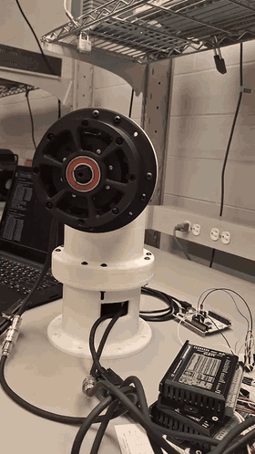
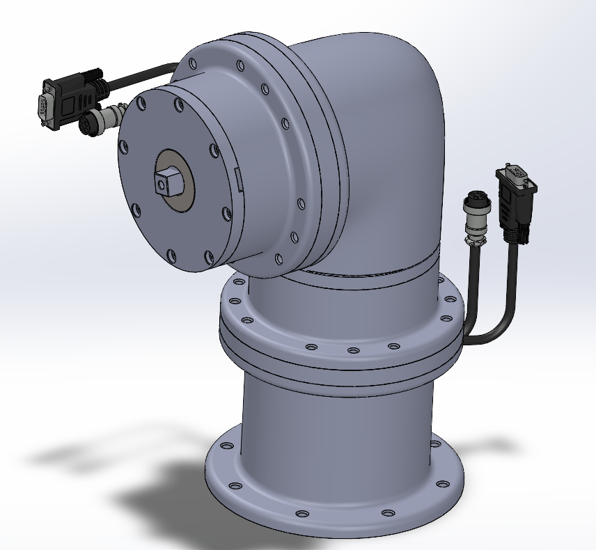
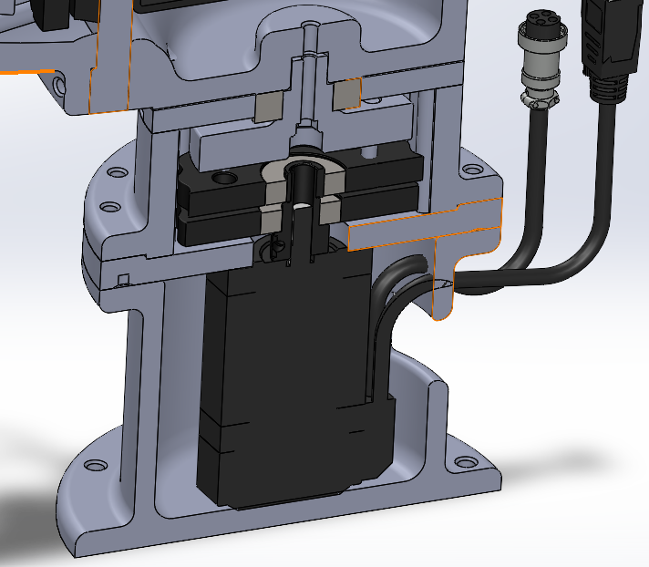

# 6-DOF Robot Arm

**Status:** early Checkpoint A ("It moves" on the bench) — not a working 6-DOF tending system.

Hobby / portfolio build: 3D-printed cycloidal joint CAD, an RS-485 motor bench, Hall homing on Arduino, and STM32 supervisory P-control for J1/J2. ROS 2 / MoveIt / Simulink trees exist as scaffolds. The headline application is not implemented.

**Stack:** STM32 (PlatformIO, P-only `JointController::Step`) · ESP32 joint-node parser · Pico + ESP32-C3 RS-485 benches · SolidWorks CAD · Python DH sandbox · ROS 2 Humble / MoveIt 2 *scaffolds* · Simulink *README only*

[](https://github.com/Chris-Alexander-Pop/robot-arm/actions/workflows/ci.yml)

## Preview

<p align="center">
  
</p>

<p align="center">
  
  
</p>

Bench motion clip (22–28 s from `20260516_220314_1_1.mp4`); CAD renders from SolidWorks.

## What actually works

- **Cycloidal joint CAD** under `mechanical/` — Maria is the primary CAD author (see Authorship).
- **RS-485 motor bench** — Pico master plus ESP32-C3 slaves, including a local Pico J0 STEP/DIR path on GP16/GP17: `firmware/scripts/hardware_tests/rs485_motor_bench/`.
- **Hall homing FSM** on Arduino: `firmware/scripts/hardware_tests/homing_arduino/src/main.ino`.
- **STM32 supervisory P-control** for J1/J2: `kDefaultKp = 2.0F`, Ki/Kd = 0, velocity cap `kMaxSupervisorVelocityDegS = 120.0F` in `firmware/stm32_core/lib/control/src/joint_controller.cpp`. Arduino `StepperDriver` uses AccelStepper for STEP/DIR. Native tests store commanded velocity only.
- **Native firmware tests** via `./firmware/scripts/test.sh`. **Renode smoke** in CI. **Python pytest** for the DH sandbox (`simulation/dh_solver.py`) and placeholder kinematics tests.

Gear ratios the controller uses: `kJ1MotorRevsPerJointRev = 19.0F`, `kJ2MotorRevsPerJointRev = 15.0F` in `firmware/stm32_core/lib/drivers/src/stepper_driver.cpp`. Physical cycloid pin/lobe counts are `[NEEDS MEASUREMENT]`.

## Not yet implemented

- `firmware/stm32_core/lib/bus/src/bus_master.cpp` — `BusMaster::Transaction` discards the frame and returns false (no RS-485 TX from the master).
- `firmware/joint_node/src/joint_node_app.cpp` — TODOs at the STEP/DIR + homing call site, gripper PWM, and homing FSM (`kHomePin`).
- `simulation/robot_arm_sim/kinematics/dh_model.py` — `forward_kinematics` returns the 4×4 identity.
- `software/ros2_ws/src/robot_description/urdf/mock_arm.urdf.xacro` — cylinder mock links, not CAD-derived geometry.
- `simulink/README.md` — planned Simulink / Embedded Coder tree; no `.slx` in the repo.
- `firmware/stm32_core/lib/drivers/src/encoder_driver.cpp` — MCU `ReadJointAngleDeg` returns 0.0 by design (position stays inside the CL57T/CL42T).

Checkpoint letters B–F in `docs/Application.md` are a delivery plan, not a progress report.

## Future application

The long-term target is **autonomous 3D-print bed tending** (detect completion, remove the part, start the next job). That application is not in this tree: there is no OctoPrint integration, no vision pick, and no end-to-end tending cycle. Treat it as a goal, not a capability.

## Architecture

| Layer | Location | Role today |
|-------|----------|------------|
| Planning | `software/ros2_ws/` | ROS 2 / MoveIt 2 **scaffold** (Docker tests exist) |
| Real-time control | `firmware/stm32_core/` | UART protocol, P-only supervisor, AccelStepper on J1/J2 |
| Joint nodes | `firmware/joint_node/` | Parses bus commands; pulse generation is TODO |
| Simulation | `simulation/` | DH sandbox + identity FK placeholder + Renode smoke |
| Mechanical | `mechanical/` | SolidWorks; STEP exports where present |
| Electrical | `hardware/` | KiCad, WireViz, datasheet references |
| Model-based design | `simulink/` | README scaffold only |

Details: [`docs/ARCHITECTURE.md`](docs/ARCHITECTURE.md) · [`docs/Design_Choices.md`](docs/Design_Choices.md)

## Quickstart (~10 minutes)

**Prerequisites:** Git, Python 3.11+, [PlatformIO](https://platformio.org/) (`pio`), Docker (for ROS tests).

```bash
git clone https://github.com/Chris-Alexander-Pop/robot-arm.git
cd robot-arm
./scripts/setup.sh

# Firmware (host native tests — no hardware)
./firmware/scripts/test.sh

# Python simulation
./simulation/scripts/test.sh

# ROS / MoveIt (Docker; slower first run)
./scripts/dev.sh up
./scripts/dev.sh moveit-test
```

Full matrix: [`TESTING.md`](TESTING.md)

## Repository map

| Path | Contents |
|------|----------|
| `docs/` | Requirements, architecture, journal |
| `mechanical/` | CAD (SolidWorks); see [`docs/implementation/cad_exports.md`](docs/implementation/cad_exports.md) |
| `hardware/` | KiCad, datasheets, WireViz |
| `firmware/` | STM32 C++ (PlatformIO), ESP32 joint_node, hardware benches |
| `software/` | ROS 2 workspace + Docker |
| `simulation/` | Python sim + Renode |
| `simulink/` | Planned MBD workspace (not in tree yet) |

## Verification (CI)

| Layer | Local | CI job |
|-------|-------|--------|
| Firmware (native) | `./firmware/scripts/test.sh` | `firmware-native-tests` |
| Firmware (Renode) | build `nucleo_f401re_renode`, `simulation/renode/tests/firmware_smoke.robot` | `firmware-build-and-renode` |
| ROS / MoveIt | `./software/scripts/test.sh` | `software-behavioral-tests` |
| Simulation | `./simulation/scripts/test.sh` | `simulation-tests` |

## Team setup

- Linux/macOS: [`./scripts/setup.sh`](scripts/setup.sh)
- Windows: [`./scripts/setup.ps1`](scripts/setup.ps1)

Creates `simulation/.venv`, `.tooling/` ROS CLI tools, and Renode for headless firmware tests. Firmware uses PlatformIO, not a Python venv.

Dev helpers: [`./scripts/dev.sh`](scripts/dev.sh) / [`./scripts/dev.ps1`](scripts/dev.ps1) for Dockerized ROS.

## Authorship

`git shortlog -sne --all` on 2026-09-06 (measured before this README commit):

| Commits | Author |
|--------:|--------|
| 93 | Maria `<mnastase@uwaterloo.ca>` |
| 88 | Chris Alexander Pop `<chrisalexanderpop@gmail.com>` |
| 5 | dependabot[bot] |
| 4 | Fatima Syeda `<f2syeda@uwaterloo.ca>` |
| 1 | Cursor Agent `<cursoragent@cursor.com>` |

Maria is the primary CAD author. This is a shared build; firmware/bench work is not a solo project.

Re-run `git shortlog -sne --all` after new commits — do not copy these counts forward without measuring.

## Contributing

See [`CONTRIBUTING.md`](CONTRIBUTING.md) and [`firmware/CONTRIBUTING.md`](firmware/CONTRIBUTING.md). Remaining `TODO(contributor)` markers are intentional scaffolds, not abandoned files. `JointController::Step` is already P-only (not a stub).

## Licenses and third-party materials

- **Source code** (firmware, ROS, simulation, scripts): [MIT](LICENSE) — see [NOTICE](NOTICE).
- **Datasheets:** vendor URLs in [`hardware/datasheets/README.txt`](hardware/datasheets/README.txt) (PDFs not in git; download locally if needed).
- **CAD:** SolidWorks native files are proprietary format; STEP provided where applicable.
- **AccelStepper** (waspinator / Mike McCauley): GPL-3.0 or commercial — J1/J2 STEP/DIR on STM32.
- **StepperDriver** (laurb9): MIT — STEP/DIR helpers and declared `joint_node` dep.
- **MATLAB / Simulink:** optional future workflow; trademarks of The MathWorks, Inc.

## Security

Hobby / bench project only — see [`SECURITY.md`](SECURITY.md). Serial control has no authentication; use a trusted USB-UART link.

## Deep dive

- [`docs/Application.md`](docs/Application.md) — checkpoints A–F (plan, not current capability)
- [`docs/Examples.md`](docs/Examples.md) — comparison with AR4, Moveo, etc.
