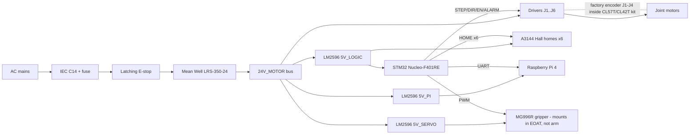

# WireViz harness diagrams

Text-based wiring docs for the 6-DOF arm. YAML in, SVG / HTML / PNG out via [WireViz](https://github.com/wireviz/WireViz).

## What is in here

| File | Scope |
|---|---|
| `10_power_distribution.yml` | AC mains, IEC inlet, E-stop, Mean Well LRS-350-24, 24V_MOTOR bus, three LM2596 buck rails. |
| `20_control_signals.yml` | STM32 Nucleo-F401RE pins, 74HC245 level shift, six driver control headers, Pi UART link. |
| `30_joint_J1_closed_loop.yml` | Detail of one closed-loop joint (CL57T + NEMA 23 + **factory encoder bundled with the kit**). Pattern repeats for J1–J4 (CL42T for J3/J4). |
| `40_joint_J5_open_loop.yml` | Detail of one open-loop wrist joint (TMC2209 + NEMA 14). AS5600 shown as an optional Phase 2 part — most builds skip it. Same shape for J6. |
| `50_homing.yml` | Six A3144 Hall HOME sensors only — compact diagram for the harness you always build. |
| `55_wrist_encoders.yml` | Optional Phase 2 path: STM32 I2C to TCA9548A and two AS5600 boards (J5/J6 only). Omit entirely if you skip wrist encoders. |
| `60_end_effector.yml` | MG996R gripper servo (mounts inside the gripper body, not the arm), `5V_SERVO` rail, PWM signal across the J6 tool flange, optional FSR. |

These follow the contracts in:

- [`docs/implementation/electrical_design.md`](../../docs/implementation/electrical_design.md)
- [`docs/implementation/electrical_interface_map.md`](../../docs/implementation/electrical_interface_map.md)
- [`firmware/pinout.md`](../../firmware/pinout.md)

WireViz is intentionally **per-harness**, not whole-system. A high-level block view lives in `electrical_schematic_plan.md` §1 and the Mermaid sketch at the bottom of this README.

## Prerequisites

- Python 3 (the venv script makes one).
- **Graphviz** (`dot`) on your PATH. WireViz fails to render without it.
  - Arch: `pacman -S graphviz`
  - Debian/Ubuntu: `apt install graphviz`

## One-time environment

From the repository root:

```bash
./scripts/create-wireviz-venv.sh
```

Activate when needed:

```bash
source hardware/wireviz/.venv/bin/activate
```

Windows (PowerShell):

```powershell
.\scripts\create-wireviz-venv.ps1
.\hardware\wireviz\.venv\Scripts\Activate.ps1
```

## Render everything

From the repo root:

```bash
./scripts/render-wireviz.sh           # all *.yml in hardware/wireviz/, HTML+SVG
./scripts/render-wireviz.sh -c -q     # clean out/ first, quiet per-file output
./scripts/render-wireviz.sh -f hsp    # also write PNG
```

Windows (PowerShell):

```powershell
.\scripts\render-wireviz.ps1 -Clean -Quiet
.\scripts\render-wireviz.ps1 -Formats hsp
```

The script picks up every `*.yml` except `_common.yml` (prepended into every render for shared Graphviz spacing and colors). Drop a new harness file in here and rerun. Output goes to `out/` (gitignored).

Render a single file:

```bash
./scripts/render-wireviz.sh 30_joint_J1_closed_loop          # by basename
./scripts/render-wireviz.sh hardware/wireviz/55_wrist_encoders.yml  # by path
```

Or call WireViz directly if you prefer:

```bash
source hardware/wireviz/.venv/bin/activate
cd hardware/wireviz
wireviz 10_power_distribution.yml -o out -O 10_power_distribution -f hs
```

`-f hs` writes both **HTML** (with a BOM table) and **SVG** (lossless graphic). Add `p` for PNG, `t` for TSV.

## How to view the diagrams

The diagrams are SVG, so anything that opens an image or web page works:

- **Browser (recommended)** – open the HTML for the BOM + diagram inline:
  ```bash
  xdg-open out/10_power_distribution.html       # Linux
  open out/10_power_distribution.html           # macOS
  start out\10_power_distribution.html          # Windows (cmd)
  ```
- **Just the diagram** – open the SVG directly:
  ```bash
  xdg-open out/10_power_distribution.svg
  ```
- **VS Code / Cursor** – open the SVG file; the editor renders it. Right-click an SVG in the Explorer ➜ *Open Preview*.
- **Image viewer** – Eye of GNOME, qView, IrfanView, Preview, etc.
- **Static site / share** – the SVG and HTML are self-contained; you can drop them into any docs folder or email them.

If you only see XML when opening the SVG, your default app is a text editor — pick a browser or image viewer instead.

## Authoring rules learned the hard way

WireViz emits Graphviz DOT under the hood. Two pitfalls cause render failures:

1. **No leading digits in identifiers or labels.** Use `P5V_LOGIC`, not `+5V_LOGIC`. Use `P24V`, not `+24V`. Same for cable IDs (`W_PWR_LOGIC`, not `W_5V_LOGIC`).
2. **No `<` or `>` characters in `subtype:` / `notes:` text.** They terminate the HTML label early. Write `to` instead of `->`, `at least 3 A` instead of `>=3 A`.

Other conventions used here:

- **`_common.yml`** — shared `options:` and a small `tweak.append` graph directive (`nodesep`, `ranksep`) so diagrams space out consistently. Large motor drivers are split into several logical connector blocks (same physical CL57T or TMC2209) so WireViz does not draw one 15–20-pin vertical tower.
- Wire colors follow the [WireViz color codes](https://github.com/wireviz/WireViz/blob/master/docs/syntax.md#wire-colors) (`RD`, `BK`, `WH`, etc.).
- Every cable that crosses the cabinet boundary is `shield: true`.
- Joint-by-joint cables (`W_CTRL_J1` … `W_CTRL_J6`) use the same color code so a real harness label survives a swap between channels.

## Where the system view lives

WireViz is bad at one-page “whole robot” views. Use this Mermaid block diagram (rendered automatically by GitHub / VS Code / Cursor) as the index:



For pin-accurate detail, jump into the matching YAML and re-render.
